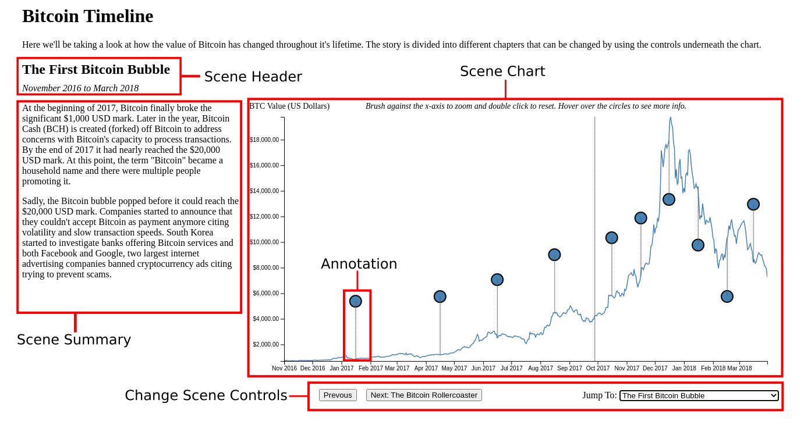
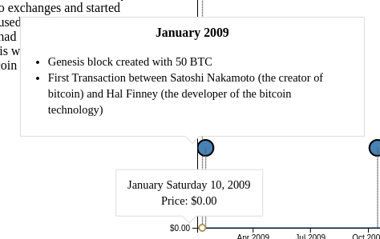
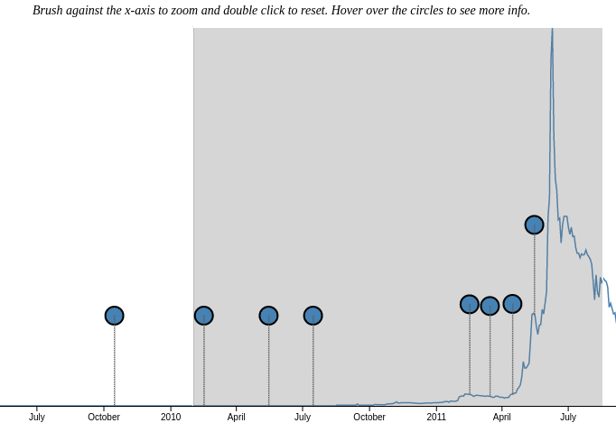

# UofI CS 416 - Narrative Visualization - Bitcoin Timeline

__Author:__ Raman Walwyn-Venugopal <rsw2@illinois.edu>

## Messaging
The message communicated throughout the visualization is how Bitcoin's value
(compared to the US Dollar) has changed throughout it's lifetime.

## Narrative Structure
The structure chosen for the visualization was an interactive slideshow that
consists of six (6) scenes each representing a time period. The first 5 scenes
are in temporal order while the last scene is a complete overview (big
picture). Within each scene a user can read a brief summary and see details of
specific events using the chart and annotations displayed.

## Visual Structure
All scenes follow the same visual structure. At the top of the scene is the
title section which includes the title and a sub-header that displays the time
period of the data for the scene. The title is important as it sets the tone
for what the scene is about and informs the user the time period of the data
that is displayed. Underneath the title section, there are two
columns. The first column on the left is smaller and contains a brief summary
and analysis of the data for the period. This summary was placed on the left
side considering that most people reading this will start here first to get the
broad picture. The second column to the right has a line graph with time on the
x axis and the BTC USD value on the y-axis.  Annotations are added to the graph
to highlight when specific events occurred and see how that relates to the
price of bitcoin. These annotations appear as blue bubbles that encourages the
user to make contact with to see more details. Underneath the chart are a
series of controls used to change the scenes, it has simple 'next/previous'
buttons and a drop-down that enables the user to quickly jump to a scene.

{ width=97% }

## Scenes
The scenes in the Bitcoin Timeline visualization are:  
1. The Inception of Bitcoin: January 2009 - October 2011  
2. Bitcoin Adoption: November 2011 - October 20216  
3. The First Bitcoin Bubble: November 2016 - March 2018  
4. The Bitcoin Rollercoaster: April 2018 - January 2020  
5. The Second Bitcoin Bubble: February 2020 - June 2021  
6. Complete Overview: January 2009 - June 2021  

The reason why the scenes are divided the way they are as that each
represent unique trends in Bitcoin. This leads to each scene having common
recurring themes and varying period lengths. The scenes are in temporal order
since the data we are viewing is the change of Bitcoin's value over time.

## Annotations
In each scene, the line graph has little bubbles placed on the line throughout
the whole scene. Hovering over the bubble produces a tooltip with information
relevant to that period of time of the graph. The tooltip approach was chosen
due to the scenes having many annotations and displaying their content all at
once would be overwhelming information to the user. The brief summary to the
right already highlights the main message of the scene, therefore the
annotations provide further details when the user wants to "dig in". Since the
annotations are time-based, they are forced to change within each scene to
match the new time period the scene represents.

{ width=25% }

## Parameters
The parameters of the visualization are just the start date and end date for
each scene. As each scene changes, the graph is refreshed to only display data
within the period defined by the scene. The same refresh is applied to the
annotations. The specific dates for each scene are noted in the "Scenes" section.

## Triggers
The triggers in the Bitcoin Timeline visualization are:
- The Scene Controls (Previous/Next/Jump To): these control elements allow the
  user to switch between different scenes. The affordances to communicate them
  to the user are displaying them in standard areas of switching between
  slides. There is also an introduction at the top of the visualization under
  the header that encourages user to interact with these controls. 

- Mouse hover on the annotations: This triggers a tooltip to appear that
  displays the content of the annotation. There is a message at the top of the
  chart encouraging the user to hover their mouse over the blue circles

- Mouse hover on the line graph: This triggers a tooltip on the linegraph that
  displays the date and price of bitcoin.

- Brushing on the x-axis: This triggers a zoom on the chart to the
  selected/brushed area. There is a message at the top of the chart explaining
  how to zoom and reset the zoom. In addition, the cursor changes to
  cross-hairs when passing the mouse over the graph and there is a line that
  follows the cursor on the x-axis

{ width=50% }
